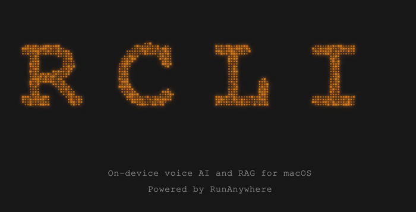

<p align="center">
  
  <br>
  <strong>Talk to your Mac, query your docs, no cloud required.</strong>
  <br><br>
  <a href="https://github.com/RunanywhereAI/RCLI"></a>
  <a href="https://github.com/RunanywhereAI/RCLI"></a>
  <a href="https://github.com/RunanywhereAI/RCLI"></a>
  <a href="LICENSE"></a>
</p>

**RCLI** is an on-device voice AI for macOS. A complete STT + LLM + TTS pipeline running natively on Apple Silicon — 43 macOS actions via voice, local RAG over your documents, sub-200ms end-to-end latency. No cloud, no API keys.

Powered by [MetalRT](#metalrt-gpu-engine), a proprietary GPU inference engine built by [RunAnywhere, Inc.](https://runanywhere.ai) specifically for Apple Silicon.

## Demo

> Real-time screen recordings on Apple Silicon — no cloud, no edits, no tricks.

<table>
<tr>
<td width="50%" align="center">
<strong>Voice Conversation</strong><br>
<em>Talk naturally — RCLI listens, understands, and responds on-device.</em><br><br>
<a href="https://youtu.be/qeardCENcV0">

</a>
<br><sub>Click for full video with audio</sub>
</td>
<td width="50%" align="center">
<strong>App Control</strong><br>
<em>Control Spotify, adjust volume — 43 macOS actions by voice.</em><br><br>
<a href="https://youtu.be/eTYwkgNoaKg">

</a>
<br><sub>Click for full video with audio</sub>
</td>
</tr>
<tr>
<td width="50%" align="center">
<strong>Models & Benchmarks</strong><br>
<em>Browse models, hot-swap LLMs, run benchmarks — all from the TUI.</em><br><br>
<a href="https://youtu.be/HD1aS37zIGE">

</a>
<br><sub>Click for full video with audio</sub>
</td>
<td width="50%" align="center">
<strong>Document Intelligence (RAG)</strong><br>
<em>Ingest docs, ask questions by voice — ~4ms hybrid retrieval.</em><br><br>
<a href="https://youtu.be/8FEfbwS7cQ8">

</a>
<br><sub>Click for full video with audio</sub>
</td>
</tr>
</table>

## Install

> **Requires macOS 13+ on Apple Silicon (M1 or later).**

**One command:**

```bash
curl -fsSL https://raw.githubusercontent.com/RunanywhereAI/RCLI/main/install.sh | bash
```

**Or via Homebrew:**

```bash
brew tap RunanywhereAI/rcli https://github.com/RunanywhereAI/RCLI.git
brew install rcli
rcli setup
```

## Quick Start

```bash
rcli                             # interactive TUI (push-to-talk + text)
rcli listen                      # continuous voice mode
rcli ask "open Safari"           # one-shot command
rcli ask "play some jazz on Spotify"
```

## Features

### Voice Pipeline

A full STT + LLM + TTS pipeline running on Metal GPU with three concurrent threads:

- **VAD** — Silero voice activity detection
- **STT** — Zipformer streaming + Whisper / Parakeet offline
- **LLM** — Qwen3 / LFM2 / Qwen3.5 with KV cache continuation and Flash Attention
- **TTS** — Double-buffered sentence-level synthesis (next sentence renders while current plays)
- **Tool Calling** — LLM-native tool call formats (Qwen3, LFM2, etc.)
- **Multi-turn Memory** — Sliding window conversation history with token-budget trimming

### 43 macOS Actions

Control your Mac by voice or text. The LLM routes intent to actions executed locally via AppleScript and shell commands.

| Category | Examples |
|----------|---------|
| **Productivity** | `create_note`, `create_reminder`, `run_shortcut` |
| **Communication** | `send_message`, `facetime_call` |
| **Media** | `play_on_spotify`, `play_apple_music`, `play_pause`, `next_track`, `set_music_volume` |
| **System** | `open_app`, `quit_app`, `set_volume`, `toggle_dark_mode`, `screenshot`, `lock_screen` |
| **Web** | `search_web`, `search_youtube`, `open_url`, `open_maps` |

Run `rcli actions` to see all 43, or toggle them on/off in the TUI Actions panel.

> **Tip:** If tool calling feels unreliable, press **X** in the TUI to clear the conversation and reset context. With small LLMs, accumulated context can degrade tool-calling accuracy — a fresh context often fixes it.

### RAG (Local Document Q&A)

Index local documents, query them by voice. Hybrid vector + BM25 retrieval with ~4ms latency over 5K+ chunks. Supports PDF, DOCX, and plain text.

```bash
rcli rag ingest ~/Documents/notes
rcli ask --rag ~/Library/RCLI/index "summarize the project plan"
```

### Interactive TUI

A terminal dashboard with push-to-talk, live hardware monitoring, model management, and an actions browser.

| Key | Action |
|-----|--------|
| **SPACE** | Push-to-talk |
| **M** | Models — browse, download, hot-swap LLM/STT/TTS |
| **A** | Actions — browse, enable/disable macOS actions |
| **B** | Benchmarks — run STT, LLM, TTS, E2E benchmarks |
| **R** | RAG — ingest documents |
| **X** | Clear conversation and reset context |
| **T** | Toggle tool call trace |
| **ESC** | Stop / close / quit |

## MetalRT GPU Engine

MetalRT is a high-performance GPU inference engine built by [RunAnywhere, Inc.](https://runanywhere.ai) specifically for Apple Silicon. It delivers the fastest on-device inference for LLM, STT, and TTS — up to **550 tok/s** LLM throughput and sub-200ms end-to-end voice latency.

> **Apple M3 or later required.** MetalRT uses Metal 3.1 GPU features available on M3, M3 Pro, M3 Max, M4, and later chips. M1/M2 support is coming soon. On M1/M2, RCLI automatically falls back to the open-source llama.cpp engine.

MetalRT is automatically installed during `rcli setup` (choose "MetalRT" or "Both"). Or install separately:

```bash
rcli metalrt install
rcli metalrt status
```

**Supported models:** Qwen3 0.6B, Qwen3 4B, Llama 3.2 3B, LFM2.5 1.2B (LLM) · Whisper Tiny/Small/Medium (STT) · Kokoro 82M with 28 voices (TTS)

MetalRT is distributed under a [proprietary license](https://github.com/RunanywhereAI/metalrt-binaries/blob/main/LICENSE). For licensing inquiries: founder@runanywhere.ai

## Supported Models

RCLI supports 20+ models across LLM, STT, TTS, VAD, and embeddings. All run locally on Apple Silicon. Use `rcli models` to browse, download, or switch.

**LLM:** LFM2 1.2B (default), LFM2 350M, LFM2.5 1.2B, LFM2 2.6B, Qwen3 0.6B, Qwen3.5 0.8B/2B/4B, Qwen3 4B

**STT:** Zipformer (streaming), Whisper base.en (offline, default), Parakeet TDT 0.6B (~1.9% WER)

**TTS:** Piper Lessac/Amy, KittenTTS Nano, Matcha LJSpeech, Kokoro English/Multi-lang

**Default install** (`rcli setup`): ~1GB — LFM2 1.2B + Whisper + Piper + Silero VAD + Snowflake embeddings.

```bash
rcli models                  # interactive model management
rcli upgrade-llm             # guided LLM upgrade
rcli voices                  # browse and switch TTS voices
rcli cleanup                 # remove unused models
```

## Architecture

```
Mic → VAD → STT → [RAG] → LLM → TTS → Speaker
                            |
                     Tool Calling → 43 macOS Actions
```

Three dedicated threads in live mode, synchronized via condition variables:

| Thread | Role |
|--------|------|
| STT | Captures audio, runs VAD, detects speech endpoints |
| LLM | Generates tokens, dispatches tool calls |
| TTS | Double-buffered sentence-level synthesis and playback |

**Key design decisions:**

- 64 MB pre-allocated memory pool — zero runtime malloc during inference
- Lock-free ring buffers for zero-copy audio transfer
- System prompt KV caching across queries
- Hardware profiling at startup for optimal config
- Token-budget conversation trimming
- Live model hot-swap without restarting

```
src/
  engines/     STT, LLM, TTS, VAD, embedding engine wrappers
  pipeline/    Orchestrator, sentence detector, text sanitizer
  rag/         Vector index, BM25, hybrid retriever
  core/        Types, ring buffer, memory pool, hardware profiler
  audio/       CoreAudio mic/speaker I/O
  tools/       Tool calling engine with JSON schema definitions
  actions/     43 macOS action implementations
  api/         C API (rcli_api.h)
  cli/         TUI dashboard (FTXUI), CLI commands
  models/      Model registries with on-demand download
```

## Build from Source

CPU-only build using llama.cpp + sherpa-onnx (no MetalRT):

```bash
git clone https://github.com/RunanywhereAI/RCLI.git && cd RCLI
bash scripts/setup.sh
bash scripts/download_models.sh
mkdir -p build && cd build
cmake .. -DCMAKE_BUILD_TYPE=Release
cmake --build . -j$(sysctl -n hw.ncpu)
./rcli
```

All dependencies are vendored or CMake-fetched. Requires CMake 3.15+ and Apple Clang (C++17).

<details>
<summary><strong>CLI Reference</strong></summary>

```
rcli                          Interactive TUI (push-to-talk + text + trace)
rcli listen                   Continuous voice mode
rcli ask <text>               One-shot text command
rcli actions [name]           List actions or show detail
rcli rag ingest <dir>         Index documents for RAG
rcli rag query <text>         Query indexed documents
rcli models [llm|stt|tts]    Manage AI models
rcli voices                   Manage TTS voices
rcli bench [--suite ...]      Run benchmarks
rcli setup                    Download default models
rcli info                     Show engine and model info

Options:
  --models <dir>      Models directory (default: ~/Library/RCLI/models)
  --rag <index>       Load RAG index for document-grounded answers
  --gpu-layers <n>    GPU layers for LLM (default: 99 = all)
  --ctx-size <n>      LLM context size (default: 4096)
  --no-speak          Text output only (no TTS)
  --verbose, -v       Debug logs
```

</details>

## Contributing

Contributions welcome. See [CONTRIBUTING.md](CONTRIBUTING.md) for build instructions and how to add new actions, models, or voices.

## License

RCLI is open source under the [MIT License](LICENSE).

MetalRT is proprietary software by [RunAnywhere, Inc.](https://runanywhere.ai), distributed under a separate [license](https://github.com/RunanywhereAI/metalrt-binaries/blob/main/LICENSE).

<p align="center">
  Built by <a href="https://www.runanywhere.ai">RunAnywhere, Inc.</a>
</p>
